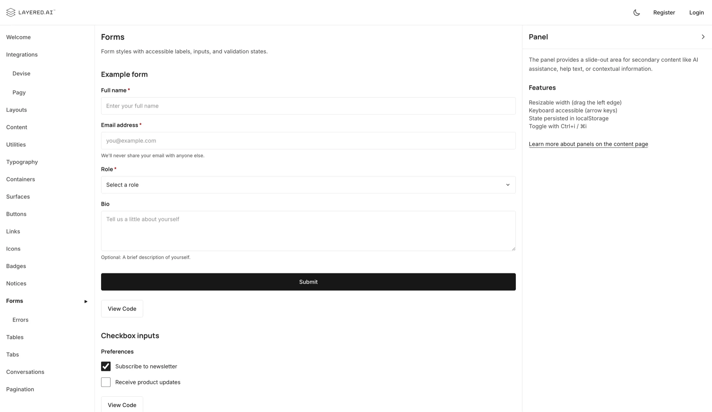
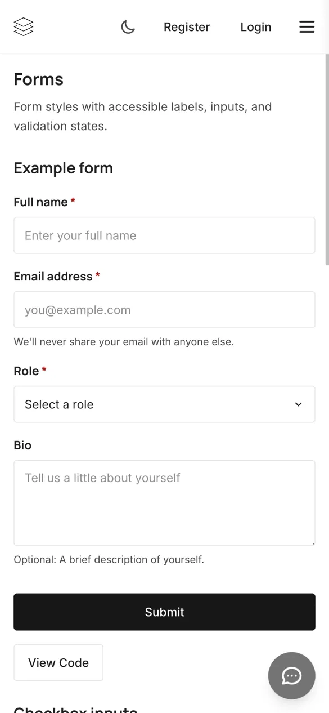
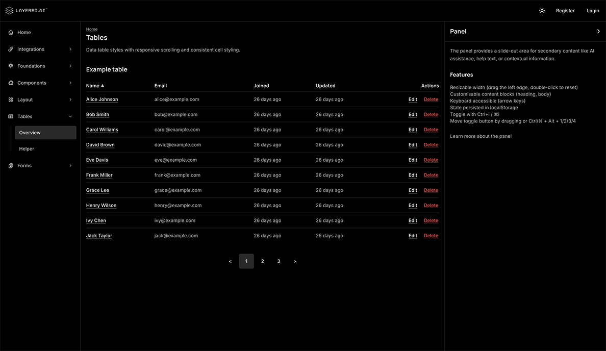
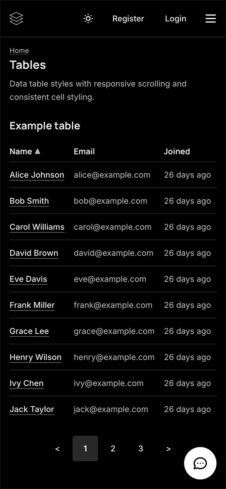

# layered-ui-rails

[](https://github.com/layered-ai-public/layered-ui-rails/actions/workflows/ci.yml)
[](https://www.w3.org/WAI/WCAG22/quickref/)
[](https://opensource.org/licenses/Apache-2.0)

An open source, Rails 8+ engine that provides WCAG 2.2 AA compliant design tokens, Tailwind CSS utilities, and Stimulus controllers for theme switching, mobile navigation, slide-out panels, modals, and tabs. Ships as pure frontend with no server-side dependencies beyond Rails and Tailwind CSS. See the [live demo](https://layered-ui-rails.layered.ai).

<table align="center">
  <tr>
    <td align="center">
      
      
    </td>
    <td width="20"></td>
    <td align="center">
      
      
    </td>
  </tr>
  <tr>
    <td align="center"><em>Light theme (desktop and mobile)</em></td>
    <td></td>
    <td align="center"><em>Dark theme (desktop and mobile)</em></td>
  </tr>
</table>

## Getting started

Add to your Gemfile and install:

```bash
bundle add layered-ui-rails
bin/rails generate layered:ui:install
```

The install generator will:
- Copy `layered_ui.css` to `app/assets/tailwind/`
- Add `@import "./layered_ui";` to your `application.css`
- Add `import "layered_ui"` to your `application.js`

Then update your application layout to render the engine layout:

```erb
<%= render template: "layouts/layered_ui/application" %>
```

## Requirements

- Ruby on Rails >= 8.0
- Tailwind CSS Rails >= 4.0
- Importmap Rails >= 2.0
- Stimulus Rails >= 1.0

## Features

- **Dark/light theme** - system preference detection with localStorage persistence and manual toggle
- **Responsive layout** - header, sidebar navigation, main content area, and optional resizable panel
- **WCAG 2.2 AA compliant** - skip links, focus indicators, ARIA attributes, and 4.5:1 contrast ratios
- **Components** - buttons, forms, surfaces, tables, tabs, notices, badges, conversations, modals, and pagination
- **Optional integrations** - Devise authentication and Pagy pagination with styled views
- **Customisable branding** - Override the default logos and icons and colors
- **Google Lighthouse** - `layered-ui-rails` scores a [perfect 100](test/dummy/app/assets/images/lighthouse.webp) across all four Google Lighthouse categories - performance, accessibility, best practices, and SEO

## Documentation

An online version of the documentation is available at **[layered-ui-rails.layered.ai](https://layered-ui-rails.layered.ai)**.

You can also run the included dummy app locally for development and testing:

```bash
git clone https://github.com/layered-ai-public/layered-ui-rails.git
cd layered-ui-rails
bundle install
cd test/dummy && bin/rails db:setup && bin/dev
```

The dummy app serves as both a living style guide and a test harness, with interactive examples and code snippets for every component.

### Deploying the dummy app

The dummy app can be deployed with [Kamal](https://kamal-deploy.org). Set the required environment variables and deploy from `test/dummy`:

```bash
cd test/dummy
export KAMAL_DEPLOY_IP=<server-ip>
export KAMAL_DEPLOY_DOMAIN=<domain>
export KAMAL_SSH_KEY=<path-to-ssh-key>
kamal deploy
```

## Contributing

This project is still in its early days. We welcome issues, feedback, and ideas - they genuinely help shape the direction of the project. That said, we're holding off on accepting pull requests until after the 1.0 release so we can stay focused on getting the core foundations right. Once we're there, we'd love to open things up to broader contributions. Thanks for your patience and interest!

## License

Released under the [Apache 2.0 License](LICENSE). The source code is fully open, but the layered.ai name and brand are trademarks of Layered AI.

- [TRADEMARK.md](TRADEMARK.md) - trademark and brand policy
- [CLA.md](CLA.md) - contributor license agreement
